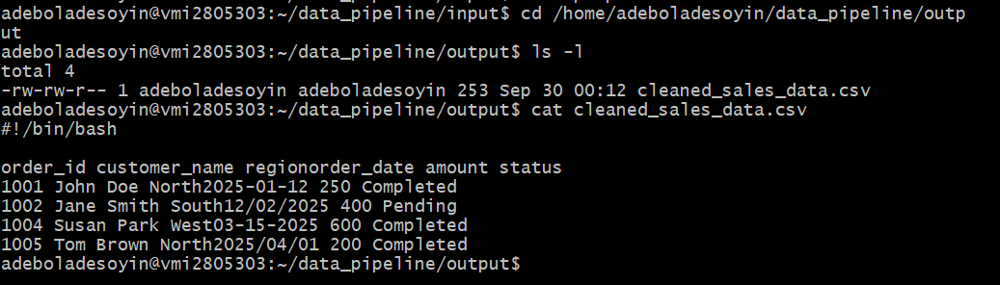
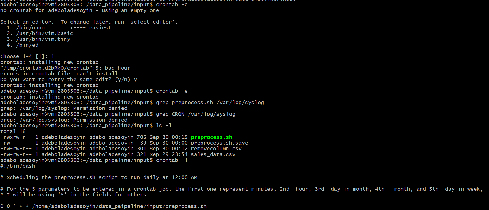
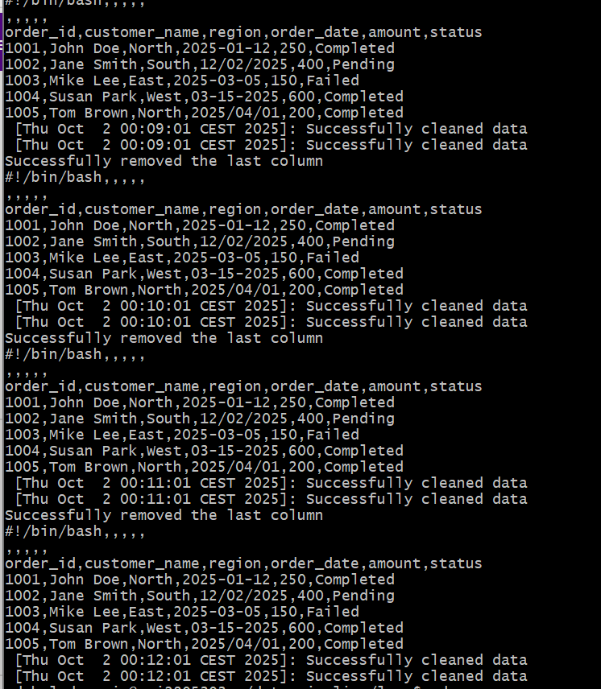
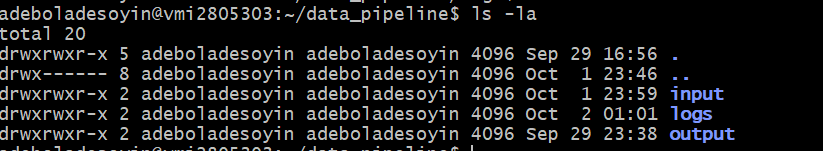
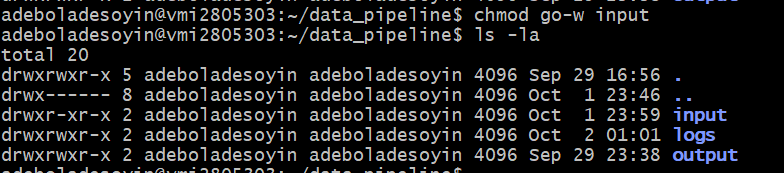
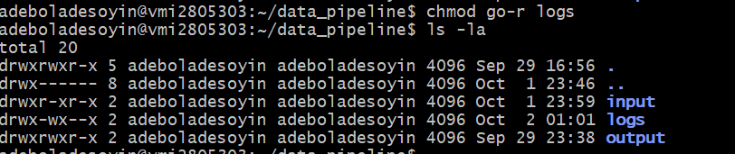

# DEC-Launchpad-Linux

## Purpose
This project is set up for a data processing pipeline using Linux commands and bash scripts. It covers:
1. File manipulation, 
2. Data automation, 
3. Permissions management, and 
4. Scheduling with cron, & logging.

## Setting up the environment

The server was accessed via SSH using a Git Bash terminal:

    ssh adeboladesoyin@***.**.**.**

Inside the data_pipeline directory, three subdirectories were created to organize the pipeline.

    mkdir data_pipeline
    cd data_pipeline
    mkdir -p input output logs
    ls -l

The input directory is used to store the raw data, the output directory holds the processed data, and the logs directory keeps the execution history.

## Data Ingestion and Pre-processing

Data source: This is a csv file provided by the mentor for this project.\
link: https://github.com/dataengineering-community/launchpad/blob/main/Linux/sales_data.csv

A new file called sales_data.csv was created in the /data_pipeline/input directory.

    cd input
    touch sales_data.csv
    nano sales_data.csv

A preprocess.sh script was created to clean and prepare the dataset, starting with the shebang line.

1. The extra_col (the 7th and last column) was removed.

2. Rows where the status (6th column) equals Failed were filtered out.

3. The cleaned dataset was saved as cleaned_sales_data.csv in the output folder.

4. A success message was echoed after the dataset was successfully cleaned.

5. Both the output and any errors were logged into a file named preprocess.log inside the /data_pipeline/logs directory.

Below is the preprocess.sh script:

    #!/bin/bash

    inputfile=home/adeboladesoyin/data_pipeline/input/sales_data.csv
    removefile=removecolumn.csv
    outputfile=/home/adeboladesoyin/data_pipeline/output/cleaned_sales_data.csv
    logfile=/home/adeboladesoyin/data_pipeline/logs/preprocess.log

    #Removing the last column from the sales_data.csv
    awk -F, '{print $1,$2,$3,$4,$5,$6}' OFS="," "$inputfile" > "$removefile"

    if [ $? -eq 0 ]; then
            echo "Successfully removed the last column" & cat "$removefile"
    else
            echo "Last column not successfully removed"
    fi

    #Filtering failed status from the data
    awk -F, '$6 != "Failed" {print $1, $2,$3.$4,$5,$6}' OFS ="," "$removefile" > "$outputfile"

    #Checking if the command is successful and also log the output and error
    if [ $? -eq 0 ]; then
            echo "Successfully removed failed and cleaned data" | tee -a "$logfile"
    else
            echo "Dataset cleaning failed" | tee -a "$logfile"
    fi

**Ensuring the script is executable**

The permission on the preprocess.sh file was seen not to be executable.

Previous output:

    -rw-rw-r-- 1 adeboladesoyin adeboladesoyin 357 Sep 29 23:27 preprocess.sh

The command below was run to give the user an executable permission:

    chmod u+x preprocess.sh

Output:

    -rwxrw-r-- 1 adeboladesoyin adeboladesoyin 357 Sep 29 23:27 preprocess.sh

**Confirming the cleaned_sales_data.csv output**

The commands below were run:

    cd /home/adeboladesoyin/data_pipeline/output
    ls -l
    cat cleaned_sales_data.csv

## Automating the Pipeline with Cron Jobs

In automating the pipeline, a cron job was created to perform the task. The command below was used to launch cron:

    crontab -e 

It opened the edit tab and the below was scheduled and run;

    # Scheduling the preprocess.sh script to run daily at 12:00 AM

    # For the 5 parameters to be entered in a crontab job, the first one represent minutes, 2nd -hour, 3rd -day in month, 4th - month, and 5th- day in week,
    # I will be using '*' in the fields for others.

    0 0 * * * /home/adeboladesoyin/data_peipeline/input/preprocess.sh

To confirm if the cron job is active, the crontab -l command is used to list the scheduled jobs for the current user on the server. Running pgrep cron helps verify whether the created job is active and running, as it returns the process ID.

    crontab -l
    pgrep cron

And here is the output below;

The content in the preprocess.log file

## Logging and Monitoring

It is important to log both the outputs of job runs and any errors that occur, as this helps in monitoring process failures and optimizing performance.

To track the pipeline’s progress, a monitor.sh script was created to scan the preprocess.log file for errors and provide a notification whenever any are detected.

    touch monitor.sh
    nano monitor.sh

The monitor.sh script uses the grep command to search the log file for keywords such as "ERROR" or "failed". If any matches are found, it prints them to the output using the echo command.

    #!/bin/bash

    #Searching for the instances of ERROR or failed word in log file

    logfile=/home/adeboladesoyin/data_pipeline/logs/preprocess.log

    Errorsearch=$(grep -Ei 'ERROR|failed' "$logfile")

    #Echoing/returning the lines returned with error or failed
    wordcount=$(echo "$Errorsearch" | wc -l)

    if [ "$wordcount" -gt 0 ]; then
            echo "$wordcount ERROR(s)/Failure(s) found in the preprocess.log file"
    else
            echo "No error or failure found"
    fi

**_Output after run**_

**Monitoring script Scheduling**

The monitor.sh script was automated by scheduling it as a cron job to run after each daily job processing, at exactly 12:05 AM. The crontab -e command was used again to edit the cron table, and the schedule was added as shown below:

    #preprocess.sh script to run daily at 12:00 AM

    # For the 5 parameters to be entered in a crontab job, the first one represent minutes, 2nd -hour, 3rd -day in month, 4th - month, and 5th- day in week,
    # I will be using '*' in the fields for others.

    0 0 * * * /home/adeboladesoyin/data_pipeline/input/preprocess.sh >> /home/adeboladesoyin/data_pipeline/logs/preprocess.log 2>&1

    #monitor.sh script to run 12:05 AM daily after the preprocess.sh job

    5 0 * * * /home/adeboladesoyin/data_pipeline/logs/monitor.sh

crontab -l was used to list all the cron jobs in the system.

## Permission & Security

Finally, security is a key responsibility for a data engineer, ensuring that access to the various directories and files is restricted only to the authorized individuals who require it.

**Input folder security**

Before permission

The below command was run to ensure only the user can be able to write to the directory.

     chmod go-w input

**Log folder security**

Read Access to log was restricted for both group and others while the user alone have the read access to the log directory.

     chmod go-r logs

## Conclusion

This project provided hands-on practice with building a data processing pipeline using Linux commands and Bash scripts.

It enhanced my understanding of file ingestion, file manipulation, automation of data processing, job orchestration through scheduling with cron, and managing permissions for users, groups, and others using the symbolic chmod method.

Thank you for reading through.

