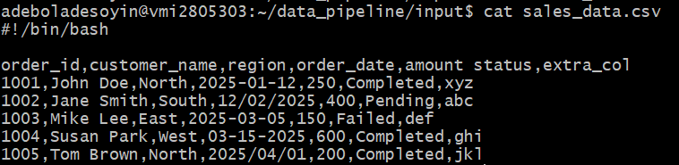

# DEC-Launchpad---Linux

## Purpose
This project is set up for a data processing pipeline using Linux commands and bash scripts. It covers:
1. File manipulation, 
2. Data automation, 
3. Permissions management, and 
4. Scheduling with cron, & logging.

## Setting up the environment
The server was connected to using ssh in a git bash terminal

    ssh adeboladesoyin@***.**.**.**

Created 3 different sub-directories inside data_pipeline directory for organizing the pipeline

    mkdir data_pipeline
    cd data_pipeline
    mkdir -p input output logs
    ls -l

The input directory would store the data.
The output will store the processed data, and the logs will save the history.

## Data Ingestion and Pre-processing

Data source: This is a csv file provided by the mentor for this project.\
link: https://github.com/dataengineering-community/launchpad/blob/main/Linux/sales_data.csv

A new file called sales_data.csv was created in the /data_pipeline/input directory.

    cd input
    touch sales_data.csv
    nano sales_data.csv

